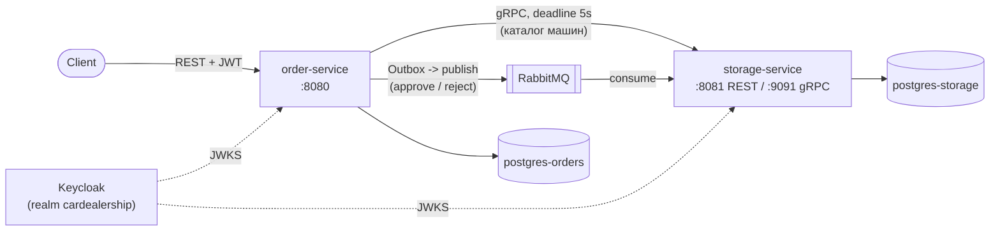

# Car Dealership


Бэкенд мультибрендового автосалона на двух микросервисах: приём и сопровождение заказов
(`order-service`) и каталог автомобилей/склад (`storage-service`). Заказ на автомобиль проходит
через полноценный жизненный цикл (менеджер -> склад -> оплата -> доставка) с ролевым доступом,
асинхронными событиями между сервисами и синхронным gRPC-каталогом.

## Архитектура



- **order-service** - заказы (комплектация / со склада), заявки на тест-драйв, пользователи.
  Хранит заказ как объект с State-паттерном: `Created(Stock|Custom) -> ApprovedByManager ->
  ApprovedByWarehouse -> AwaitingPayment -> Paid -> (ReadyForIssue | AwaitingDelivery) -> Completed`
  - заказ со склада после оплаты сразу готов к выдаче, заказ под комплектацию уходит в доставку;
  на каждом шаге допустима отмена через отдельный `cancel()`-переход.
- **storage-service** - каталог машин, комплектующие, сборочные заказы. Отдаёт каталог
  через REST (клиентам) и через gRPC (order-service, синхронный сервис-сервис вызов).
- Между сервисами два канала: **gRPC** для быстрых синхронных запросов каталога и
  **RabbitMQ + Outbox Pattern** для надёжной доставки событий об одобрении/отклонении заказа
  (запись в БД в той же транзакции, что и бизнес-изменение, публикация - отдельным
  scheduled-воркером, что исключает потерю событий при падении сервиса между коммитом и publish).

## Инженерные решения, которые здесь есть

- **Outbox Pattern** вместо прямой публикации в очередь - `OutboxEventRepository` пишет событие
  в той же транзакции, что и смену состояния заказа; отдельный `OutboxPublisher` вычитывает и
  публикует необработанные записи с `SELECT ... FOR UPDATE`, что даёт at-least-once доставку и
  безопасно работает при горизонтальном масштабировании order-service.
- **State Pattern** для жизненного цикла заказа и заявки на тест-драйв - каждое состояние знает,
  какие переходы допустимы, недопустимые переходы кидают доменное исключение, а не решаются
  через `if/switch` в сервисе.
- **gRPC с деградацией** - order-service ходит в storage-service по gRPC с дедлайном (5s);
  `UNAVAILABLE`/`DEADLINE_EXCEEDED` от gRPC-статуса маппится в доменный `ServiceUnavailableException`
  -> клиент получает осмысленный 503, а не зависшую REST-ручку.
- **Keycloak + Spring Security** - оба сервиса проверяют JWT независимо (resource server), роли
  (`MANAGER`, `WAREHOUSE_ADMIN`, `USER`, `ADMIN`) проверяются как на уровне HTTP-security, так и
  точечно в сервисном слое через `@PreAuthorize`/кастомный `OrderSecurityService` (например,
  клиент может смотреть только свои заказы).
- **Testcontainers** - интеграционные тесты (REST и gRPC) поднимают настоящие Postgres/RabbitMQ,
  проверяют миграции Liquibase и реальный gRPC-обмен между `order-service` и `storage-service`,
  а не моки.

## Стек

| Слой            | Технологии                                                          |
|-----------------|----------------------------------------------------------------------|
| Язык / рантайм  | Java 21, Gradle (multi-module)                                       |
| Web / API       | Spring Boot 3, Spring Data JPA, Swagger/OpenAPI (springdoc)          |
| Данные          | PostgreSQL 16 (отдельная БД на сервис), Liquibase                    |
| Межсервисное    | gRPC (protobuf-контракт, blocking stub, deadline), RabbitMQ + Outbox |
| Безопасность    | Spring Security (resource server), Keycloak (JWT, RBAC)              |
| Тесты           | JUnit 5, Testcontainers (Postgres, RabbitMQ), unit + integration     |
| Инфраструктура  | Docker / Docker Compose, GitHub Actions CI                           |
| Маппинг         | MapStruct, Lombok                                                    |

## Быстрый старт

```bash
docker compose up --build
```

Поднимутся: Postgres x2 (`5432`/`5433`), RabbitMQ (`5672`, UI на `15672`), Keycloak (`8180`,
реалм `cardealership` импортируется автоматически), `order-service` (`8080`), `storage-service`
(`8081` REST + `9091` gRPC).

Swagger UI:
- `http://localhost:8080/swagger-ui.html` - order-service
- `http://localhost:8081/swagger-ui.html` - storage-service

Демо-пользователи Keycloak (реалм `cardealership`, пароль `password`):

| username   | роль            |
|------------|-----------------|
| `manager`  | `MANAGER`       |
| `customer` | `USER`          |
| `admin`    | `ADMIN`         |

## Локальная разработка без Docker для сервисов

```bash
./gradlew :order-service:bootRun
./gradlew :storage-service:bootRun
```

(инфраструктуру - Postgres/RabbitMQ/Keycloak - при этом всё равно проще поднять через
`docker compose up postgres-orders postgres-storage rabbitmq keycloak`)

## Тесты

```bash
./gradlew test              # unit
./gradlew integrationTest   # Testcontainers: REST + gRPC + Liquibase
```

## Структура

```
order-service/
  domain/order/state/       - State Pattern для заказа
  domain/order/testDriveState/
  infrastructure/outbox/    - Outbox Pattern
  grpc/                     - gRPC-клиент к storage-service
  messaging/                - RabbitMQ consumer/producer, outbox publisher
storage-service/
  domain/car, domain/assembly
  grpc/                     - gRPC-сервер каталога
  messaging/                - consumer/producer сборочных заказов
```

## Контекст

Проект вырос из курса «Разработка ПО» в Университете ИТМО: пять итераций (доменная модель ->
персистентность и REST -> безопасность -> межсервисное взаимодействие через RabbitMQ ->
gRPC), каждая со своим прицелом на конкретную инженерную практику. История коммитов сохранена
как есть - по ней видно, как код проходил через ревью и рефакторинг на каждом шаге.
